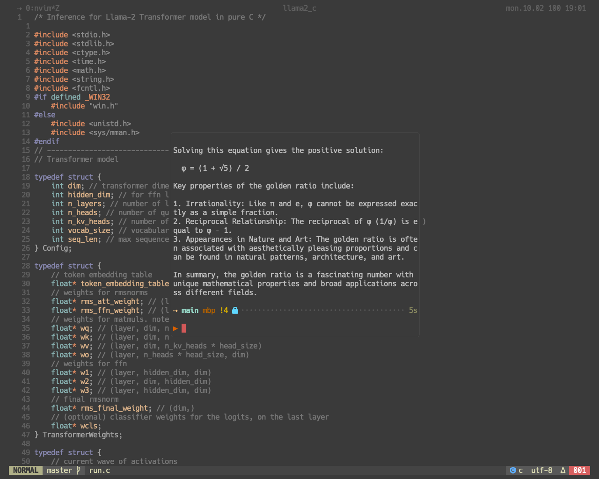

# tmux-float-term
> Creates a simple floating terminal window in tmux.



## Features
- Floating terminal overlay on top of your tmux session
- Customizable size, position, and appearance
- Toggle with a single keystroke
- Works seamlessly with existing tmux workflows
- Maximize floating terminal with separate keybinding

## Installation
Requires tmux version 3.3 or later.

### Using [TPM](https://github.com/tmux-plugins/tpm) (recommended)
Add this line to your `~/.tmux.conf`:

```bash
set -g @plugin 'frizadiga/tmux-float-term'
```

Then press `prefix` + <kbd>I</kbd> to install.

## Configuration

Set these options in your `~/.tmux.conf` file:

```bash
# Default values shown
set -g @tmux-float-term-bind 'a'                    # Key binding to toggle floating terminal
set -g @tmux-float-term-maximize-bind 'A'           # Key binding to toggle maximized floating terminal
set -g @tmux-float-term-width '60%'                 # Width of regular floating terminal
set -g @tmux-float-term-height '60%'                # Height of regular floating terminal
set -g @tmux-float-term-max-width '90%'             # Width of maximized floating terminal
set -g @tmux-float-term-max-height '90%'            # Height of maximized floating terminal
set -g @tmux-float-term-text-color 'white'          # Text color
set -g @tmux-float-term-border-color 'grey'         # Border color
set -g @tmux-float-term-title ''                    # Custom title for the floating terminal
set -g @tmux-float-term-change-path 'true'          # Change to current pane's path
set -g @tmux-float-term-session-name 'tmux-float-term-session'  # Name of the floating session
```

## Usage

### Regular Floating Terminal
1. Press your tmux prefix (default: <kbd>ctrl</kbd>+<kbd>b</kbd>)
2. Press the configured toggle key (default: <kbd>a</kbd>)

### Maximized Floating Terminal
1. Press your tmux prefix (default: <kbd>ctrl</kbd>+<kbd>b</kbd>)
2. Press the configured maximize key (default: <kbd>A</kbd>)

The floating terminal will appear in either regular or maximized size. Press the same key combination to dismiss it.

**Note**: If your tmux prefix is `ctrl+space`, then the maximize combination would be `ctrl+space` followed by `A`.

## Troubleshooting
- If the floating window doesn't appear, ensure your tmux version is 3.3+
- For issues with appearance, try adjusting the width and height values
- Make sure your key bindings don't conflict with existing tmux shortcuts
